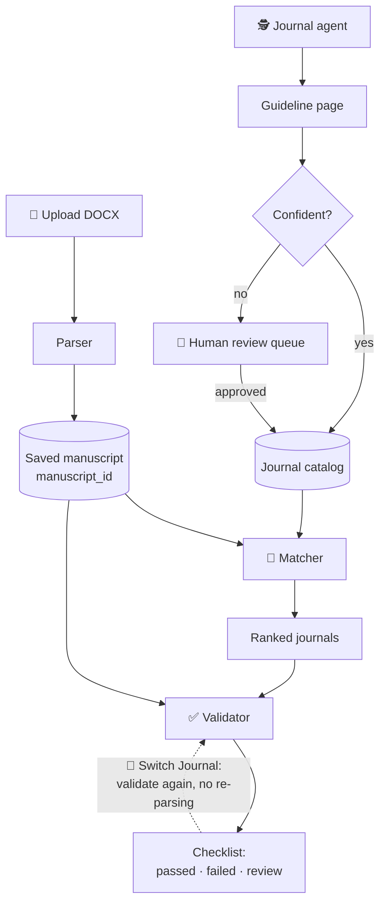

<div align="center">

# وَرّاق · Warraq

### كل فكرة .. ورّاقة ✨

**Your research is done. Getting it published shouldn't feel like a second PhD.**


</div>

---

## 📜 Why "Warraq"?

In classical Arabic book culture, the **ورّاق** was the person who copied, prepared and sold
manuscripts: the one who turned an author's work into something ready for readers.
We're doing the same job, just with fewer ink stains.

## 😩 The problem, in one story

You finish your paper. 🎉 Then you open twelve journal websites in twelve tabs. One wants a
250-word abstract, another wants 300. One wants APA, another wants IEEE. One wants "highlights"
(what even are those?). You finally pick a journal, reformat everything… and then decide it's too
expensive. Back to tab one. 🔁

**Warraq fixes that.** It recommends journals that fit your paper *and* your priorities, turns each
journal's guidelines into a checklist, checks your manuscript against it, and lets you switch
journals in one click without starting over.

---

## 🚀 What it does

- 📄 **Upload a manuscript** (DOCX). Warraq extracts the title, abstract, keywords, sections, references,
  tables and figures.
- 🎯 **Recommend journals** by scope fit, filtered by the researcher's priorities: APC budget, open
  access, review time, indexing and article type.
- 🕵️ **Collect journal requirements** from each journal's official author-guideline page with an AI agent.
  Every rule keeps a link to its source, and anything the agent is unsure about goes to a human review
  queue instead of being guessed.
- ✅ **Check the manuscript** against the chosen journal: title and abstract length, keywords, word count,
  reference range, citation style, tables and figures, highlights, and required statements.
- 🔀 **Switch journal** in one click. The checklist is recalculated for the new journal without re-parsing
  the paper.
- 🤖 **Suggest fixes with AI**: a scope-fit assessment, shorter titles or abstracts, draft highlights and
  missing statements, and citation style conversion (for example IEEE to APA). Nothing is applied
  without the researcher's approval.

### ⚖️ Hard rules vs. AI suggestions

The golden rule of Warraq: **the AI suggests, the researcher decides.** The two are kept strictly apart:

| | Hard requirements | AI suggestions |
| --- | --- | --- |
| Examples | Title ≤ 15 words, 30–60 references, APA style, data availability statement | Scope fit, a shorter title, a draft statement |
| How they're checked | Plain code, no AI: the same paper and journal always give the same result | An LLM, clearly labelled as a suggestion |
| Source | Stated by the journal, linked to its page | Generated for the researcher to review |
| Applied automatically? | Never | Never: the researcher accepts or rejects each one |

---

## 🧭 How it works



---

## 🗂️ Repository structure

```
Warraq/
├── apps/
│   ├── api/                  FastAPI backend (Python)
│   │   ├── core/             settings (.env)
│   │   ├── db/               SQLite store, demo journal seed, agent runner
│   │   ├── models/           shared data contracts (Pydantic)
│   │   ├── routers/          API endpoints
│   │   ├── services/
│   │   │   ├── analyzer/       DOCX parsing
│   │   │   ├── journal_agent/  guideline scraping + extraction (LangGraph)
│   │   │   ├── matcher/        journal recommendation
│   │   │   ├── validator/      deterministic submission checklist
│   │   │   ├── suggestions/    AI suggestions
│   │   │   ├── citations/      citation style conversion
│   │   │   └── llm/            LLM gateway (model per task, caching, cost logging)
│   │   └── tests/
│   └── web/                  Next.js frontend (Arabic, RTL)
├── docs/                     contracts, checklist rules, LLMOps
└── .env.example              backend settings template
```

### 🧰 Tech stack

- **Backend:** Python, FastAPI, Pydantic, SQLite, python-docx, sentence-transformers, LangGraph
- **AI:** Anthropic Claude through a single LLM gateway (see [`docs/llmops.md`](docs/llmops.md))
- **Frontend:** Next.js (App Router), TypeScript, Tailwind CSS, Monaco Editor

---

## 🏁 Getting started

You need **Python 3.11+** and **Node.js 20.9+**. Open two terminals, grab a coffee ☕, and let's go.

### 1️⃣ Backend

**Windows (PowerShell):**

```powershell
cd apps/api
python -m venv .venv
.venv\Scripts\Activate.ps1
pip install -r requirements.txt
copy ..\..\.env.example .env
uvicorn main:app --reload
```

**macOS / Linux:**

```bash
cd apps/api
python3 -m venv .venv
source .venv/bin/activate
pip install -r requirements.txt
cp ../../.env.example .env
uvicorn main:app --reload
```

- API: http://localhost:8000 · Interactive docs: http://localhost:8000/docs · Health: http://localhost:8000/health
- Add your key to `apps/api/.env` as `ANTHROPIC_API_KEY=...` to enable the AI features. Without it,
  AI suggestions and citation conversion report "unavailable"; everything else works.
- The first journal match downloads the embedding model (~90 MB), so it can take up to a minute.

If PowerShell says "running scripts is disabled", run
`Set-ExecutionPolicy -Scope CurrentUser RemoteSigned` once and try again.

### 2️⃣ Frontend

```bash
cd apps/web
npm ci
npm run dev
```

Open **http://localhost:3000** (use `localhost`, not `127.0.0.1`). The frontend calls the backend at
`http://localhost:8000` by default. More details: [`apps/web/README.md`](apps/web/README.md).

### 3️⃣ Take it for a spin

Use **"جرّب ببحث تجريبي"** on the upload screen, or upload
`apps/api/tests/fixtures/warraq_demo_manuscript.docx`. Then pick preferences, choose a journal, and
switch journals in the workspace and watch the checklist change. 🪄

---

## ⚙️ Configuration

Backend settings live in `apps/api/.env` (template: [`.env.example`](.env.example)). Never commit `.env`.

| Variable | Default | Purpose |
| --- | --- | --- |
| `ANTHROPIC_API_KEY` | (empty) | Enables AI features and the journal agent |
| `FRONTEND_ORIGINS` | `http://localhost:3000` | Comma-separated origins allowed to call the API |
| `DATABASE_PATH` | `apps/api/data/warraq.db` | SQLite database file |
| `SEED_DEMO_JOURNALS` | `true` | Load the demo journals into an empty database |
| `MAX_UPLOAD_MB` | `25` | Largest manuscript upload |
| `JOURNAL_EXTRACTION_MODEL` | `claude-sonnet-5` | Model for reading journal guidelines |
| `SUGGESTIONS_MODEL` | `claude-sonnet-5` | Model for AI suggestions |
| `CITATION_MODEL` | `claude-haiku-4-5-20251001` | Model for citation conversion |
| `LLM_CACHE_ENABLED` | `true` | Reuse identical AI answers instead of paying again |
| `LLM_TIMEOUT_SECONDS` | `60` | Timeout for AI requests |

The frontend has one setting, `NEXT_PUBLIC_API_BASE_URL`, in `apps/web/.env.local`. It is public, so
never put secrets there.

---

## 🔌 API overview

Full request and response shapes are in [`docs/contracts.md`](docs/contracts.md) and at `/docs` when the
backend is running.

| Method | Endpoint | Purpose |
| --- | --- | --- |
| POST | `/manuscripts/upload` | Parse a DOCX and return a `manuscript_id` (identical files are served from cache) |
| GET | `/manuscripts/{id}` | A saved manuscript |
| GET | `/journals` | Journal catalog as summary cards |
| GET | `/journals/{id}` | One journal's full rules and sources |
| GET | `/journals/review-queue` | Journals the agent flagged for human review |
| GET · PATCH | `/journals/review-queue/{id}` | View or correct a flagged journal |
| POST | `/journals/review-queue/{id}/approve` · `/reject` | Approve into the catalog or reject |
| POST | `/match` | Rank journals for a manuscript and preferences |
| POST | `/validate` | Submission checklist for one journal (Switch Journal = call again) |
| POST | `/validate/compare` | Readiness summary for several journals |
| POST | `/suggestions` | AI scope fit and drafts for failed rules |
| PATCH | `/suggestions/{id}` | Accept or reject a suggestion |
| POST | `/citations/convert` | References in the journal's required style |
| GET | `/llm/usage` | AI calls, tokens and estimated cost per task |

### 📚 Loading real journals

```bash
cd apps/api
python -m db.run_agent                       # journals listed in db/seed/journal_sources.json
python -m db.run_agent path/to/sources.json  # your own list
```

Confident extractions go straight into the catalog; uncertain ones wait in the review queue.

---

## 🧪 Tests

```bash
cd apps/api && pytest                                          # backend (no API key or network needed)
cd apps/web && npx tsc --noEmit && npm run lint && npm run build   # frontend
```

---

## 🎭 Demo data

- **Demo journals** (`is_demo: true`) are made up (no journals were harmed), with example rules, so the app works before real
  journals are loaded. They are labelled as demo data in the UI.
- **Demo manuscript** (`apps/api/tests/fixtures/warraq_demo_manuscript.docx`) is a fictional paper: invented authors, results and references.
  Its expected checklist results for each demo journal are in [`docs/validation.md`](docs/validation.md).

---

## 📖 Documentation

| File | Contents |
| --- | --- |
| [`docs/contracts.md`](docs/contracts.md) | Data formats, endpoints, team decisions, frontend mapping |
| [`docs/validation.md`](docs/validation.md) | Checklist rules, statuses, expected demo results |
| [`docs/llmops.md`](docs/llmops.md) | LLM gateway, model per task, costs, suggestions, citation conversion |
| [`apps/api/README.md`](apps/api/README.md) | Backend setup and conventions |
| [`apps/web/README.md`](apps/web/README.md) | Frontend setup, API boundary, routes |

---

## 🚧 Known limitations

Honest list, because we'd rather tell you than have you find out:

- DOCX uploads only; PDF and LaTeX are future work.
- Page count can't be measured from a DOCX, so it is always shown for manual review.
- Citation style detection recognizes APA and IEEE; other styles are flagged for review.
- SQLite storage and no user accounts yet; the journal review endpoints are unprotected.
- AI cost figures are estimates from a price table in `apps/api/services/llm/pricing.py`.

---

## 🤝 Contributing

1. Update `main` (`git checkout main && git pull`) and create a branch from it.
2. Keep backend imports relative to `apps/api`, read settings through `core.config.get_settings()`,
   and make every AI call through `services.llm.get_gateway()`.
3. Add new fields to shared models in `apps/api/models/` as optional, and tell whoever uses them.
4. Run the tests, open a pull request, and pull `main` again after it's merged.

And please don't upload files straight to `main` through the GitHub website. We've all done it once. 🙈

---

## 👩‍💻 The team

| | Member |
| --- | --- | 
| 🕵️ | Abrar | 
| 🔌 | Jana | 
| 🎨 | Maha |
| 📄 | Estabraq |
| 🎯 | Dima |

<div align="center">

**Made with ☕ and a lot of rejected-then-reformatted papers.**

</div>
